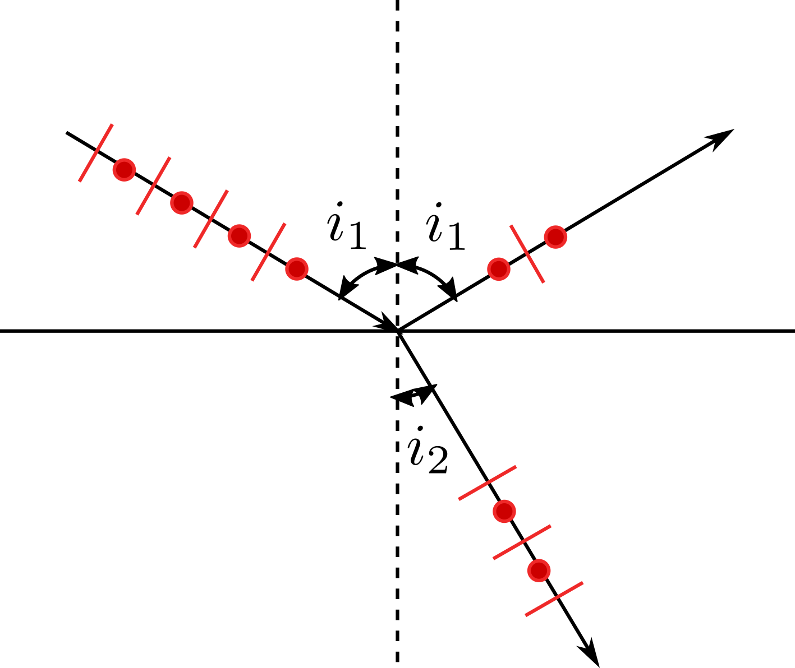

光学性能
========

光的基本性质
------------

具有波粒二象性，光量子遵循爱因斯坦关系 :math:`\varepsilon=\hbar\omega,\vec{p}=\hbar\vec{k}` 。

真空光速 :math:`c=\frac{1}{\sqrt{\varepsilon_0\mu_0}}` ，能流密度 :math:`\vec{S}=\vec{E}\times\vec{H}` ，光强 :math:`I=\frac{c}{4\pi}E^2_0` .

光的电场分量与物质中的电子作用，引起电子极化，导致光速下降，产生折射。电子吸收光子之后跃迁，产生吸收。进入物质的光可分为反射、吸收、透过、散射四部分。

光在固体中的传播
----------------

光的反射与折射
++++++++++++++

反射角等于入射角，折射角服从折射定律： 

.. math::

	\frac{\sin i_1}{\sin i_2}=\frac{v_1}{v_2}=\frac{n_2}{n_1}=n_{12}
	
其中折射率 :math:`n=\frac{c}{v}=\sqrt{\varepsilon\mu}` ，对于无机物， :math:`\mu=1` ，故折射率随介电常数升高而升高。

反过来，当光由光密介质射向光疏介质，若 :math:`\sin i_2\ge\frac{n_1}{n_2}=\frac{v_2}{v_1}` 时，发生全反射。

色散用 :math:`CD=\frac{\mathrm{d}n}{\mathrm{d}\lambda}` 表征，色散关系与材料有关，但都是波长越短折射率越大。

立方晶系以外的晶体具有光学各向异性，具有光轴，当光线入射后分解成两束偏振光：满足折射定律的o光和不满足的e光。e光折射线不在入射面内，折射率与晶体方向有关。可以利用这一原理制成尼克尔双折射棱镜，获取线偏振光。

在某一时刻，自然光中包含各个振动方向的光，而偏振光仅有一个振动方向，其中线偏振光振动方向始终不变，椭圆偏振光振动方向不断旋转。线偏振光在通过检偏器时强度衰减： :math:`I=I_0\cos^2\theta` ，其中 :math:`\theta` 为偏振方向与光栅方向夹角。

如上图所示，振动方向在反射平面内的光反射较少，折射较多，当 :math:`\tan i_1=\frac{n_2}{n_1}=n_{12}` ，即 :math:`i_1+i_2=\frac{\pi}{2}` 时，完全消除，反射光为振动方向垂直于反射平面的线偏振光。该角度称为布儒斯特角。

光的吸收
++++++++

朗伯定律： :math:`I=I_0\exp(-\beta l)` 其中 :math:`\beta` 为线吸收系数。

不存在全波长透明的物质，金属、半导体在可见光区有吸收峰，电介质在红外、紫外区有吸收峰。 

光的散射
++++++++

光在不均匀结构处出现次级波，与主波干涉而偏离传播方向。散射衰减率满足 :math:`I=I_0\exp(-S l)` 。散射中心尺寸约等于入射光波长时，散射系数出现峰值。

散射后光子能量不变，则为弹性散射，散射光强 

.. math:: I_S\propto \frac{1}{\lambda^\sigma} 

其中 :math:`\sigma` 与散射中心尺寸 :math:`d_0` 有关： 

- :math:`d_0\gg \lambda,\sigma\to 0` 对所有波长散射能力相同
- :math:`d_0\approx \lambda,\sigma=0\sim 4` ，较为复杂
- :math:`d_0\ll \lambda,\sigma=4` ，对短波的散射明显较强
  
光的透射
++++++++

.. math:: I=I_0(1-R)^2e^{-(\beta+S)x}

非金属材料是否透明，取决于光子能量与禁带宽度的大小。如果吸收部分可见光，则为带色透明。 

材料的光发射
------------

激发之后，电子发生跃迁： 

- 一个能带准能级间跃迁 → 连续谱
- 主壳层间跃迁 → 特征谱
- 亚壳层（能带）间跃迁 → 单色光
  
激发之后也可能不发光，将能量转化为热能。 

发光性能
++++++++

- 发射光谱：发射光强~波长关系
- 激发光谱：某波长发射光强~激发光波长关系，激发波长是吸收波长的子集
- 发光寿命：激发停止后持续发光的时间，把光强衰减到 :math:`\frac{1}{10}` 的时间称为余辉时间
- 发光效率：量子效率、功率效率、光度效率
  
发光原理有两种：分立中心发光，中心通常是掺杂在透明基体材料中的离子，有时也可以是基体自身的基团；复合发光时电子跃迁涉及固体能带，导带的电子回到价带与空穴复合，发光。

激光
++++

受激发光时在外来电子的作用下诱发电子能级的转变，释放出与外来光子相同的光子。外来光子能量应与能级差接近，过程中不发生吸收。

激光发射条件：物质中高能态电子多于低能态，且半衰期较长，不会自发陷落，为此必须实现粒子数反转。实际应用中有多种激活介质和激励方式。

耦合光学效应
------------

- 电光效应（外电场下介质折射率变化）：外电场诱发分子极化，改变固有电矩
- 磁光效应
  
  - 法拉第效应（强磁场下物质出现旋光性）：光与原子磁矩作用
  - 科顿-莫顿效应（强磁场下介质出现双折射）：外磁场导致分子定向排列
  - 塞曼效应（对物质施加磁场，光谱分裂）

- 光弹效应（施加应力材料折射率变化）：原子堆积和电子结合都更紧密
- 声光效应
  
  - 布拉格衍射：声波波长短，光倾斜入社，发生布拉格衍射，仅有0级和1级
  - 拉曼-奈斯衍射：声波波长长，光水平入射，产生多级衍射