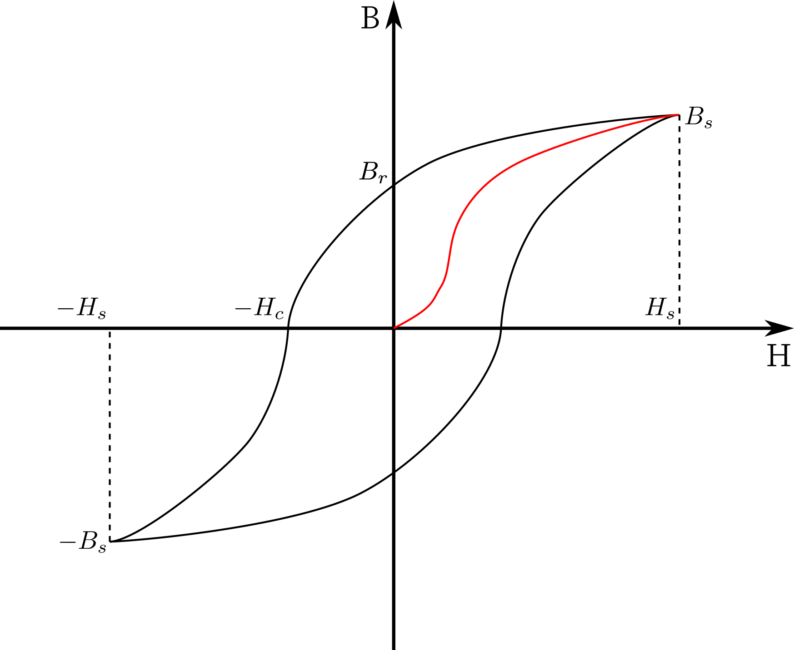

磁学性能
========

基本概念
--------

封闭电流的 **磁矩** :math:`\vec{m}=IS\vec{n}` ，其在磁场中会受力矩作用 :math:`\vec{T}=\vec{m}\times\vec{B}` 使磁矩产生转向势能最低方向的倾向，因而有 **静磁能** :math:`E=-\vec{m}\cdot\vec{B}` 。

磁性的来源是 **原子固有磁矩** :math:`\vec{P}_m` ，包括三部分，影响由大到小：电子自旋磁矩，电子轨道磁矩，原子核磁矩。一般忽略后者。电子磁矩的单位是 **玻尔磁子** :math:`m_B=\frac{e\hbar}{2m_e c}` 。

电流为 I 的无限长直导线在距中心 r 处形成的磁场强度为 :math:`H=\frac{I}{2\pi r}` 。材料在外磁场作用下被磁化，单位体积的磁矩称为 **磁化强度** ，与外磁场有关：

.. math::

	\vec{M}=\frac{\sum\vec{P}_m}{V}=\chi\vec{H},其中\chi为磁化率

则磁感应强度 

.. math::

	&\vec{B}=\mu\vec{H}=\mu_0\mu_r\vec{H}=\mu_0(1+\chi)\vec{H}=\mu_0(\vec{H}+\vec{M})\\
	&其中相对磁导率\mu_r=1+\chi

磁性分类
--------

金属的磁性要从五个方面考虑： 

- 正离子的顺磁性：具有奇数电子的原子具有固有磁矩
- 正离子的抗磁性：电子在外磁场中产生拉莫进动
- 自由电子的顺磁性：源于自旋磁矩，小
- 自由电子的抗磁性：源于电子运动，更小
- 自发磁化：源于相邻原子间的电子交换作用，对铁磁性起主要作用
  
在各因素作用下，材料呈现顺磁性、抗磁性、铁磁性、亚铁磁性、反铁磁性。 

顺磁性
++++++

受热运动影响，磁化十分困难， :math:`\chi>0` 但很小。对于正常顺磁体，满足居里外斯定律： 

.. math::

	\chi=\frac{C}{T+\Delta},其中C为常数

Δ 对于一定材料而言也是常数。对于有铁磁转变的物质， :math:`\Delta=-T_c,T_c为居里温度` ；对于少数物质，Δ=0.

存在一些反常的顺磁体，χ 不随温度变化。 

**例如** 氧分子，Pt，Ia族，IIa族。

抗磁性
++++++

:math:`\chi<0` 但非常小。经典抗磁体 χ 不随温度变化；反常抗磁体 χ 较大且随温度变化。

**例如** 贵金属，非金属

类铁磁性
--------

自发磁化
++++++++

铁磁体内存在强分子场，使磁畴范围内接近饱和磁化。对于原子内有未填满的电子层的过渡金属，相邻原子间存在电子交换作用，交换能 :math:`E_{ex}=A\cos\phi` ，则：

- :math:`A>0:\phi=0时E_{ex}最大` ，相邻自旋磁矩平行排列，自发磁化，铁磁性。 
- :math:`A<0:\phi=\pi时E_{ex}最大` ，相邻自旋磁矩反平行排列，自发磁化，反铁磁性。 
- :math:`A=0` ，紊乱排列，顺磁性。 

铁磁性
++++++

χ很大，M 与 H 为非线性关系，一般表示为磁滞回线。 

初次磁化时，材料的起始磁导率 :math:`\mu_a=\lim\frac{\Delta B}{\Delta H}` 较小，之后达到最到磁导率 :math:`\mu_{max}` 再下降。图中 :math:`B_s` 为饱和磁感应强度，此时材料达到 :math:`M_s` 饱和磁化强度。在 H 减弱之后，仍有剩余磁感应强度 :math:`B_r` ，为将其消除，要施加矫顽力 :math:`H_c` 。磁滞回线包围的面积即磁滞损耗 :math:`Q` 。

- 软磁材料： :math:`H_c小而\chi大`
- 硬磁/永磁材料： :math:`H_c大而\chi小`
  
**例如** Fe，Co，Ni及其合金、金属间化合物。

反铁磁性
++++++++

χ为小的正数，温度低于奈尔温度 :math:`T_N` 时，χ随温度升高而增大；温度高于 :math:`T_N` 时，转变为顺磁性。

**例如** 3d过渡元素或稀土元素。

亚铁磁性
++++++++

由磁矩大小不同的两种原子组成，相邻自旋磁矩反平行排列，二者之差表现为宏观磁矩。 

**例如** 铁氧体。

磁各向异性
----------

不同晶向的磁性能不同，称为磁晶各向异性。说明铁磁体中除元磁矩耦合外，还有元磁矩与原子点阵的耦合。磁晶各向异性能取决于方向余弦 

.. math::

	&E_k=K_0+K_1(\alpha^2\beta^2+\beta^2\gamma^2+\gamma^2\alpha^2)+K_2\alpha^2\beta^2\gamma^2\\
	&其中K_1,K_2为磁晶各向异性常数，一般忽略K_2

这样可算出易磁化方向和难磁化方向。 

铁磁体的退磁场与形状有关，对磁性有重要影响。 

磁致伸缩
--------

磁化引起机械应变，应力也将影响铁磁材料磁化强度。当饱和磁化时，有饱和磁致伸缩系数 :math:`\lambda_s` 。体积磁致伸缩系数的数量级一般都很小。